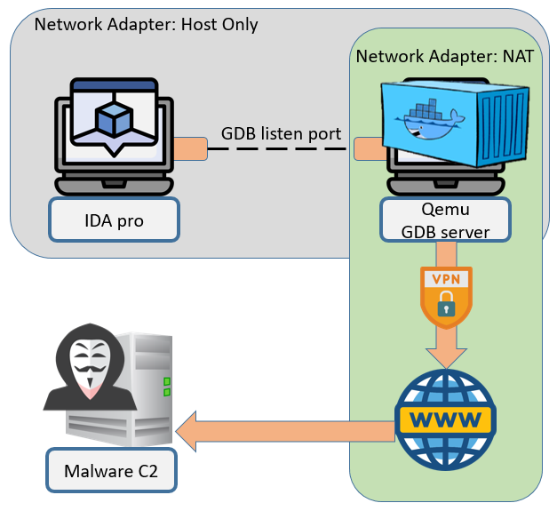

# Linux malware GDB container
using qemu with GDB server to dynamic analysis malware


# Dynamically Analyze Virtual Machine Architectures
### IDA pro: host only
### GDB server: host only & NAT




# Usage

## 1. Build docker image

```bash
docker build -t your_image_name - < qemu_sandbox
```

## 2. Up container.

> Up container in host
* make sure your network already used VPN before your start gdbserver.
```bash
docker run -it --net=host -v $PWD/output:/output/ -v your_malware_path:/sample/:Z --cap-add=NET_RAW --cap-add=NET_ADMIN --cap-add=SYS_PTRACE --security-opt seccomp=unconfined your_image_name 
```

> Start Tshark network traffic in container
```bash 
tshark -w /output/pg.pcap -F pcap &
```
> Using qemu start gdbserver in container
```bash
qemu-YOUR_FILE_CORE-static -g [GDBSERVER_PORT] [YOUR_SAMPLE_PATH] &
```
* The core of your file can be confirmed using the machine field of readelf.
  ```bash
  readelf -a malware_file
  ```

## 3. Switch to IDA PRO

* Setting IDA remote options to malware file path in container. 
* Setting IDA remote options to this vm ip and you want listen port on gdbserver.

# Reference
Build image of arm architecture on x86 machine
  https://zhuanlan.zhihu.com/p/106054643
  


